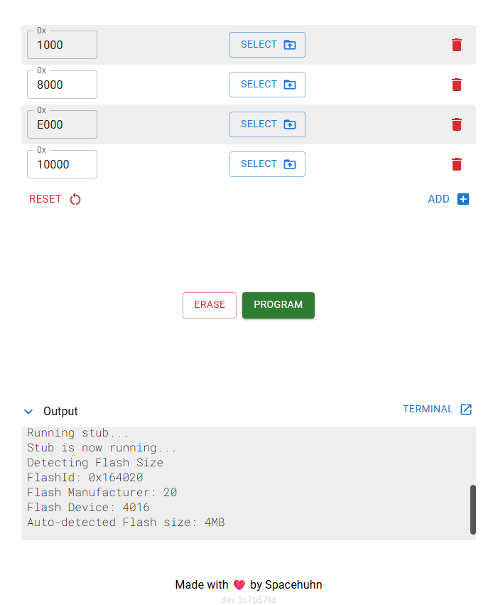
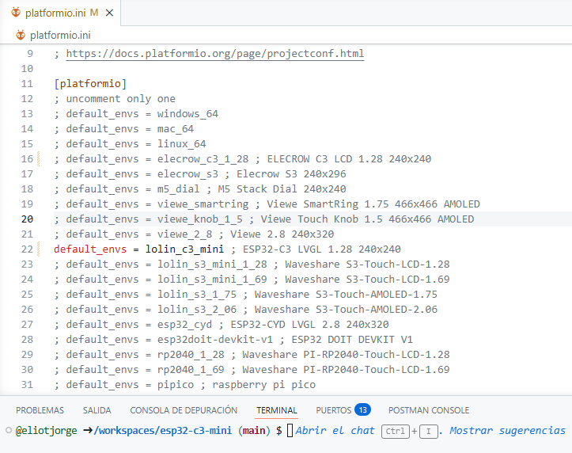

## Flasear ESP32 Online

- Al conectar la placa al ordenador para progamarla, hay que mantener pulsado el botón Boot.

- Para programarla sep eude usar el programa de Arduino o de manera online el WEB ESP Tool 👇

[**WEB ESP Tool** - para flashear Placas ESP32 online](https://esptool.spacehuhn.com/){:target="_blank"}

- Cuando conectamos la placa a la web (pide que selecciones la placa en un pop-up) aparecen 4 espacios de memoria.

- El que nos interesa es el "0x10000"

| Dirección | Qué es                         |
| --------- | ------------------------------ |
| `0x1000`  | bootloader                     |
| `0x8000`  | tabla de particiones           |
| `0xE000`  | OTA / config                   |
| `0x10000` | 👉 TU firmware (el importante) |

- Podemos pulsar en la papelera de la derecha porque lo que hace es borrar de las opciones para subirlo, pero con no seleccionar archivo es suficiente

- Hay que seleccionar un archivo `.bin` que es el que tendrá el sistema operativo llamado Firmware. De hecho el archivo es normal que se llame "Firmware.bin"

- Cuando se cargue se pincha en **Program** que te preguntará que si quieres sobreescribir. Sí queremos.

---

## Compilar **Firmware.bin** en codespace de Github

- Hacemos fork del [repo de Github del proyecto](https://github.com/fbiego/esp32-c3-mini/){:target="_blank"} y creamos un Codespace como siempre.

- Tenemos que tenre instalado la Extensión **PlatformIO** (Si lo tenemos en nuestra config de VSCode con sincronizar el archivo ya aparecerá)
 
- Cuando le demos la primera vez instalará el IDE en VSCode.

- Cuando esté instalado en la parte de abajo de VSCode aparecerán unos iconos que son shortcuts a los comandos de PlatforIO

- El que nos interesa es el check que compila el firmware.bin en la carpeta '.pio/buil/lolin_c3_mini' que tenemos que descargar.

- Tenemos que configurar el entorno de PlatformIO para que haga la build para nuestra placa si no no encenderá o los pines del backlight no estarán configurados.

- Para cambiar el entorno abrimos el archivo `platformio.ini` y en la parte de arriba comentar todo y sólo dejar el de nuestra paca.

- Viene por defecto `default_envs = elecrow_c3_1_28 ; ELECROW C3 LCD 1.28 240x240` y nuestra placa **NO ES ESA**

- Comentar con `;` y descomentar `default_envs = lolin_c3_mini ; ESP32-C3 LVGL 1.28 240x240` La primera vez que hagamos una compilación tardará mucho (8min apox) porque configura el entorno para la buena placa.

