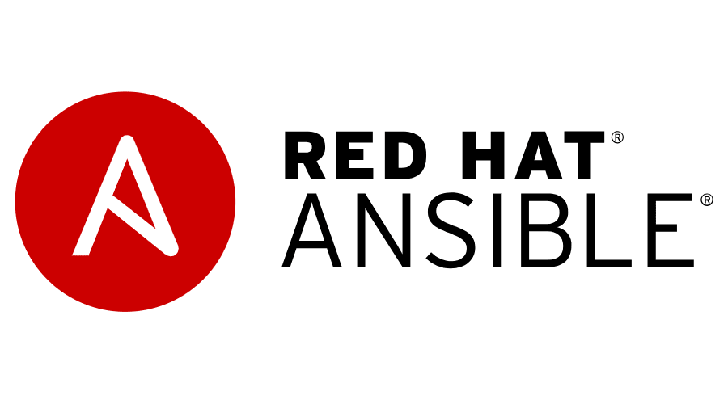

Type a couple sentences here in a paragraph format to highlight the upcoming document. A thesis statement basically..

## Introduction

Talk about what the actual thing is.

## Setup

Talk about setup.

Here are examples of post formatting:

Some code.

```bash
code example here
```

An image.

{: w="840" h="400" }

A youtube video.



Highlight blocks.

> this is an info prompt. others are tip, warning, and danger.
{: .prompt-info }


linking another post

If you need help setting up Docker see my guide here: [A deep dive on Docker]()

Table here

| Syntax      | Description |
| ----------- | ----------- |
| Header      | Title       |
| Paragraph   | Text        |


