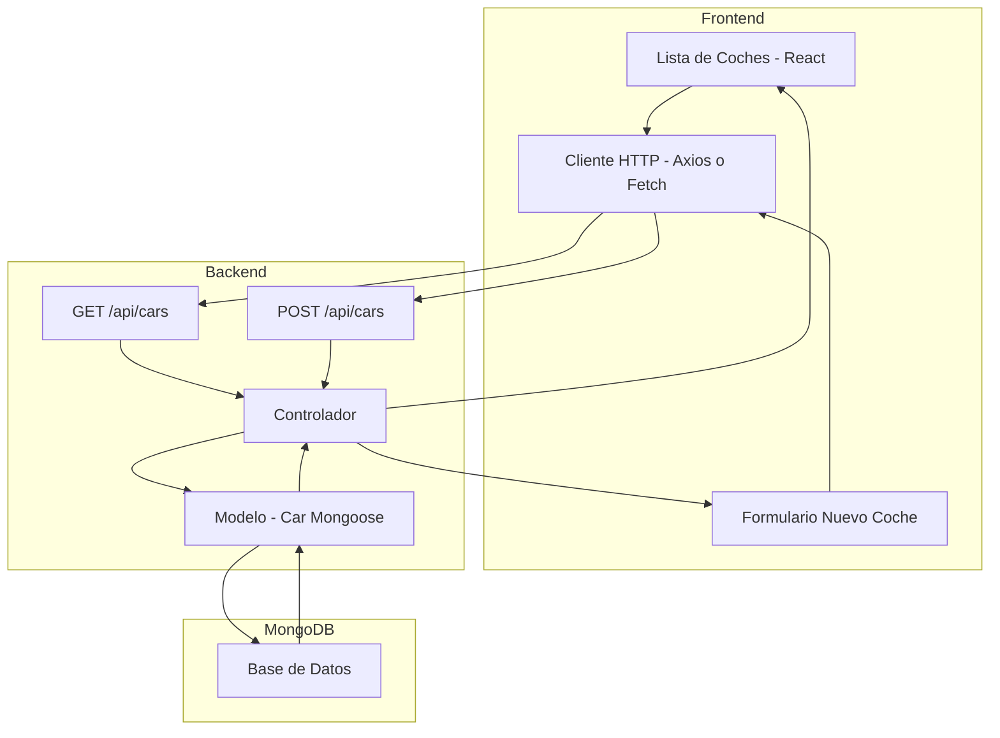

## 📊 Diagrama Flowchart

```mermaid
flowchart TD
  subgraph Frontend
    R1[Lista de Coches - React]
    R2[Formulario Nuevo Coche]
    R3[Cliente HTTP - Axios o Fetch]
  end

  subgraph Backend
    E1[GET /api/cars]
    E2[POST /api/cars]
    C[Controlador]
    M[Modelo - Car Mongoose]
  end

  subgraph MongoDB
    DB[Base de Datos]
  end

  R1 --> R3
  R2 --> R3
  R3 --> E1
  R3 --> E2
  E1 --> C
  E2 --> C
  C --> M
  M --> DB
  DB --> M
  M --> C
  C --> R1
  C --> R2
```
